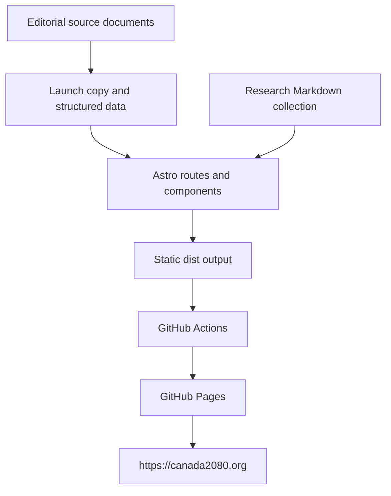

# Site Overview

## System Shape

## Route Map

| Route | Content role | Primary evidence treatment |
|---|---|---|
| `/` | Permanent mission, trajectory, Five Gaps, missions, featured kickoff, research, journal, and participation | Mixed labels in context |
| `/trajectory/` | Preferred 2026-2080 path, near-term gates, and offramps | Aspirations, scenarios, and warning signals |
| `/five-gaps/` | Problem definitions and systemic feedback loop | Verified and qualified claims |
| `/missions/` | Six regional missions and common services | Aspirations and hypotheses |
| `/research/` | Research index | Entry-specific metadata |
| `/research/[slug]/` | Individual research entry | Entry-specific metadata and sources |
| `/events/` | Current and future event index | Approved event status and logistics |
| `/events/[slug]/` | Event programme, contributors, access, and later public record | Consent and non-endorsement boundary |
| `/journal/` | Announcements, event records, reflections, and accountability | Entry-specific metadata |
| `/journal/[slug]/` | Individual editorial entry | Attribution and rights review |
| `/about/` | Scope, provenance, and publication standard | Verified initiative context |
| `/join/` | Audience-specific calls to action | Aspirations and operational next steps |

## Content Flow

1. The editorial team converts reviewed source material into page copy, structured data, or research, event, and journal Markdown.
2. A reviewer checks claim class, provenance, source availability, consent, rights, non-endorsement language, and sensitivity.
3. Astro validates collection frontmatter during `pnpm run check` and generates static HTML with `pnpm run build`.
4. GitHub Actions uploads `dist/` and deploys it to GitHub Pages.

## Content Boundaries

The public site distinguishes climate exposure from displacement and migration. It treats the 2080 horizon as an ambition and scenario boundary. It presents Waterloo as one field case, not a national template. Indigenous Nations and knowledge holders are rights-bearing authorities, not a design motif or a source of unconsented content.
